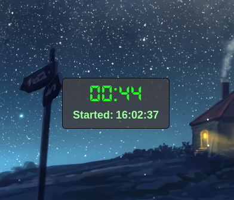
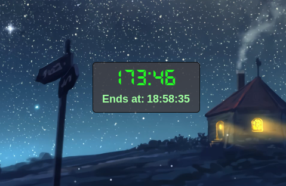
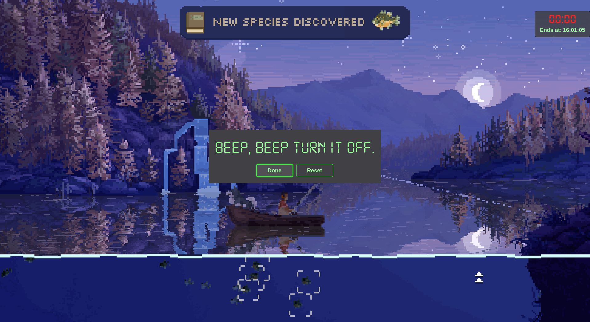

# TimeBomb!

<div align="center">


*A floating stopwatch and timer for Linux and Windows that stays on top of everything - even fullscreen apps.*

</div>

---

## What is this?

TimeBomb is a minimal, always-visible timer/stopwatch that floats above your screen. I built it because I needed something that:
- Stays visible during fullscreen games/videos
- Doesn't require clicking around
- Works entirely with keyboard shortcuts
- Doesn't get in the way

It's basically a tiny floating window you can drag anywhere, and it just works.

## Features

<div align="center">

| Stopwatch Mode | Timer Mode |
|:--------------:|:----------:|
|  |  |
| Counts up from 00:00 | Counts down with end-time preview |

</div>

- **Stopwatch mode** - counts up from 00:00
- **Timer mode** - counts down from any time you set
- **Always on top** - even over fullscreen apps
- **Keyboard shortcuts** - Win+key combos for quick control
- **Adjustable timer** - hold Win+Up/Down to quickly change timer duration
- **Sound feedback** - satisfying beeps for start/pause/reset
- **Alarm** - loud persistent alarm when timer finishes
- **Remembers position** - window stays where you put it
- **Freezing feature** - hold Win after a keybind to freeze the timer/stopwatch for precise control and flow
- **Cross-platform** - works on both Linux and Windows
- **Comprehensive logging** - automatic error logging and autostart debugging

<div align="center">



*Persistent alarm when timer completes - won't stop until you dismiss it*

</div>

## Platform Support

### Linux
- **Tested on:** Fedora, openSUSE Tumbleweed, Debian (Linux Mint), Arch (EndeavourOS)
- Uses GtkLayerShell for proper "always on top" overlay support, even on fullscreen apps and games
- Direct keyboard access via evdev
- Comprehensive logging system with automatic cleanup

### Windows
- Uses AutoHotkey for system integration
- **Built-in suppression** - Win+key shortcuts won't trigger Windows shortcuts
- **Fewer features** than Linux version (simpler implementation)
- Comes as both `.ahk` (requires AutoHotkey) and `.exe` (standalone)

## Keybinds

All shortcuts use the **Win (Super/Meta)** key:

| Shortcut | Action |
|----------|--------|
| `Win + ` ` | Toggle visibility (show/hide) |
| `Win + Enter` | Pause/Resume |
| `Win + Backspace` | Reset |
| `Win + Esc` | Switch between Timer/Stopwatch |
| `Win + Up` | Increase timer (Timer mode only) |
| `Win + Down` | Decrease timer (Timer mode only) |

### The Freezing Feature

When you perform any keybind (except `Win + Enter`), if you **keep holding the Win key**, the timer/stopwatch will freeze until you release it. This gives you:
- **Precise control** - adjust or reset without losing track of time
- **Flow** - smooth, intentional interactions
- **Feel** - it just *feels* right when you use it

Try it: Press `Win + Grave` to show TimeBomb, then keep Win held - notice how the time freezes? Release Win and it resumes. It's surprisingly addictive.

**Note (Linux only):** These shortcuts might conflict with your system's default keybinds. One workaround is to create a custom shortcut via the system settings, make it execute a command - "true", and assign the conflicting shortcuts to it. This acts as a cheap suppression system. Please do look forward to future updates with built-in suppression.

## Installation

### Linux

**File structure:**
```
Linux/
├── install.sh              # Automated installation script
├── uninstall.sh            # Clean uninstallation script
├── assets/
│   ├── font/               # DS-Digital font variants
│   │   ├── DS-DIGI.TTF     # Regular
│   │   ├── DS-DIGIB.TTF    # Bold
│   │   ├── DS-DIGII.TTF    # Italic
│   │   ├── DS-DIGIT.TTF    # Thin
│   │   └── DS-DIGITAL-LICENSE.txt
│   ├── sounds/             # Sound effects
│   │   ├── adjust.wav
│   │   ├── alarm.wav
│   │   ├── pause.wav
│   │   ├── play.wav
│   │   ├── reset.wav
│   │   ├── start.wav
│   │   ├── switch_stopwatch.wav
│   │   └── switch_timer.wav
│   ├── state/              # Saved state (auto-generated)
│   │   ├── .gitkeep
│   │   └── state.ini       # Window position and mode
│   └── logs/               # Application logs (auto-generated)
│       ├── .gitkeep
│       ├── timebomb_YYYYMMDD.log  # Daily logs
│       └── autostart.log   # Autostart debug log
└── python/
    ├── venv/               # Virtual environment (auto-generated)
    ├── app_manager.py      # App state management
    ├── gui.py              # GTK interface
    ├── hotkey.py           # Keyboard listener
    ├── stopwatch.py        # Stopwatch logic
    ├── timebomb.py         # Main entry point
    └── timer.py            # Timer logic
```

**Dependencies:**
- Python 3.8+
- GTK 3
- GtkLayerShell
- Python packages: evdev, PyGObject, pyudev
- PulseAudio (for sounds)

**Installation:**
```bash
# Clone the repo
git clone https://github.com/caffienerd/timebomb.git
cd timebomb/Linux

# Make install script executable
chmod +x install.sh

# Run install script
./install.sh
```

The install script handles:
- Detecting your package manager (apt/dnf/pacman/zypper)
- Installing system dependencies
- Creating Python virtual environment
- Installing Python packages (evdev, PyGObject, pyudev)
- Installing DS-Digital fonts
- Adding your user to the `input` group (required for keyboard access)
- Creating log and state directories
- Setting up autostart (optional)

**Important:** You'll need to **log out and back in** after installation for the `input` group permissions to take effect.

#### Autostart Configuration

The install script can set up TimeBomb to start automatically on login using XDG autostart (works on all distros and desktop environments).

**Features:**
- 12-second startup delay to ensure desktop environment is ready
- Automatic retry logic (waits up to 20 seconds for display)
- Comprehensive logging for debugging startup issues
- Logs saved to `assets/logs/autostart.log`

**Manual autostart setup:**

If you skipped autostart during installation:

```bash
mkdir -p ~/.config/autostart

cat > ~/.config/autostart/timebomb.desktop <<'EOF'
[Desktop Entry]
Type=Application
Name=TimeBomb
Comment=Floating Timer/Stopwatch
Exec=bash -c "sleep 12 && env GDK_BACKEND=x11 /path/to/timebomb/Linux/python/venv/bin/python3 /path/to/timebomb/Linux/python/timebomb.py >> /path/to/timebomb/Linux/assets/logs/autostart.log 2>&1"
Terminal=false
StartupNotify=false
Hidden=false
NoDisplay=false
X-GNOME-Autostart-enabled=true
X-GNOME-Autostart-Delay=12
Categories=Utility;
Keywords=timer;stopwatch;clock;
EOF

chmod 644 ~/.config/autostart/timebomb.desktop
```

**Important:** Replace `/path/to/timebomb/` with your actual TimeBomb installation directory.

To disable autostart:
```bash
rm ~/.config/autostart/timebomb.desktop
```

#### Logging System

TimeBomb includes comprehensive logging to help debug issues:

- **Daily logs:** `assets/logs/timebomb_YYYYMMDD.log`
  - One log file per day
  - Automatic cleanup (keeps last 30 days)
  - Contains all app events and errors

- **Autostart log:** `assets/logs/autostart.log`
  - Captures startup output when launched via autostart
  - Useful for debugging boot issues

**View logs:**
```bash
# View today's log
tail -f ~/path/to/timebomb/Linux/assets/logs/timebomb_$(date +%Y%m%d).log

# View autostart log
cat ~/path/to/timebomb/Linux/assets/logs/autostart.log

# List all logs
ls -lh ~/path/to/timebomb/Linux/assets/logs/
```

### Windows

Two options:

**Option 1: Standalone .exe (easiest)**
1. Download `timebomb.exe` from the `windows` folder
2. Double-click to run
3. (Optional) Add to startup:
   - Press `Win + R`, type `shell:startup`, press Enter
   - Create a shortcut to `timebomb.exe` in the startup folder

**Option 2: AutoHotkey script**
1. Install [AutoHotkey](https://www.autohotkey.com/)
2. Download `timebomb.ahk` from the `windows` folder
3. Double-click `timebomb.ahk` to run
4. (Optional) Add to startup folder same as above

**Windows folder structure:**
```
windows/
├── gui_state/
│   └── timebomb_config.ini
├── icon/
│   └── timebomb.ico
├── settings/
│   └── settings.txt
├── sounds/
│   ├── adjust.wav
│   ├── alarm.wav
│   ├── pause.wav
│   ├── play.wav
│   ├── reset.wav
│   ├── start.wav
│   ├── switch_stopwatch.wav
│   └── switch_timer.wav
├── timebomb.ahk
└── timebomb.exe
```

## Uninstallation

### Linux
```bash
cd timebomb/Linux
chmod +x uninstall.sh
./uninstall.sh
```

The uninstall script will:
- Stop any running TimeBomb processes
- Remove autostart entry
- Remove virtual environment
- Optionally remove DS-Digital fonts
- Optionally remove you from the `input` group
- Optionally remove state and log files

Note: System packages (Python, GTK, etc.) are not removed.

### Windows
Just delete the folder. If you added it to startup, remove the shortcut from the startup folder.

## Troubleshooting

### Linux

**TimeBomb doesn't start on login:**
- Check autostart log: `cat ~/path/to/timebomb/Linux/assets/logs/autostart.log`
- Verify desktop file exists: `ls ~/.config/autostart/timebomb.desktop`
- Check permissions: Desktop file should NOT be executable (`-rw-r--r--`)

**Keyboard shortcuts not working:**
- Ensure you're in the `input` group: `groups | grep input`
- If not, run: `sudo usermod -a -G input $USER`
- Log out and back in for changes to take effect

**GTK initialization errors:**
- Check if display is ready: The app waits up to 20 seconds for GTK to initialize
- View logs to see retry attempts
- If using autostart, ensure the 12-second delay is sufficient for your system

**Viewing debug information:**
```bash
# Check if TimeBomb is running
ps aux | grep timebomb

# View real-time logs
tail -f ~/path/to/timebomb/Linux/assets/logs/timebomb_$(date +%Y%m%d).log

# Check autostart configuration
cat ~/.config/autostart/timebomb.desktop
```

### Windows
- None currently - suppression works perfectly! The Windows version is just not as polished.

## Why "TimeBomb"?

No reason, it's just that the name was available!

## Why Win/Super key?
TimeBomb uses Win+key combos because it's the only modifier not heavily used by applications. Ctrl, Alt, and Shift would conflict with browser shortcuts, terminal commands, and app hotkeys.

## Technical Details

### Linux
- Built with GTK 3 and Python
- Uses GtkLayerShell for proper Wayland overlay support
- Direct keyboard access via evdev (no X11 dependencies)
- Threaded keyboard listener to avoid blocking the GUI
- Hot-plug support for USB keyboards
- Comprehensive logging with automatic rotation and cleanup
- Graceful startup with retry logic for autostart reliability

### Windows
- Built with AutoHotkey
- Native Win+key suppression (no conflicts!)
- Simpler implementation than Linux version
- Saves state to INI files

## Known Issues

### Linux
- Requires your user to be in the `input` group
- Won't work over certain system modals (lockscreen, etc.)
- Keybind conflicts with system shortcuts (add custom shortcuts for a cheap workaround as mentioned in the note above)

### Windows
- Windows version is functional but less polished than Linux version

## TODO

- Built-in keybind suppression system for Linux
- Polish Windows version

## License

MIT - do whatever you want with it

## Contributing

If you find bugs or want features, open an issue. PRs welcome.

Especially interested in hearing if it worked for you!!

## Credits
TimeBomb uses the DS-Digital font by Dusit Supasawat for the retro timer display.

## Third-Party Assets

### DS-Digital Font
- **Author:** Dusit Supasawat
- **License:** Freeware for personal and commercial use
- **Source:** [dafont.com/ds-digital.font](https://www.dafont.com/ds-digital.font)
- **Location:** `Linux/assets/font/`

This font is included for convenience and is property of its original author.